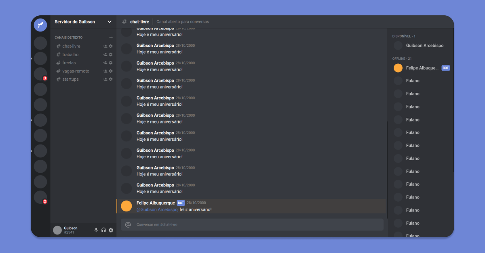

<h3 align="center">
    
</h3>

<h1 align="center">
  

  
</h1>

<h1 align="center">
    
</h1>

## :blue_book: The app

This simple <strong>[Discord](https://discord.com/new)</strong> clone was created with the intention of gaining more knowledge about <strong><i>CSS Grid Layout</i></strong>.

CSS Grid Layout is a W3C specification designed to provide a two-dimensional method for creating a CSS layout that offers the possibility to design page items using lines and columns. This type of layout is generally used to divide the page into large regions.

Despite being somewhat similar to tables, Grid Layout is not based on structuring content, allowing for a huge variety of layouts, which is not possible with tables.

This application was built in this [video](https://www.youtube.com/watch?v=x4FdZd2-_uU) by [Rocketseat](https://rocketseat.com.br/).

View the [live demo](https://discord-ui-clone-guibsonarc.netlify.app/):

## :computer: Technologies

- [x] [TypeScript](https://www.typescriptlang.org/)
- [x] [React.js](https://reactjs.org/)

<h1></h1>
<h4 align="center">
    Made by <a href="https://www.linkedin.com/in/guibsonarc/" target="_blank">Guibson Arcebispo</a>
</h4>